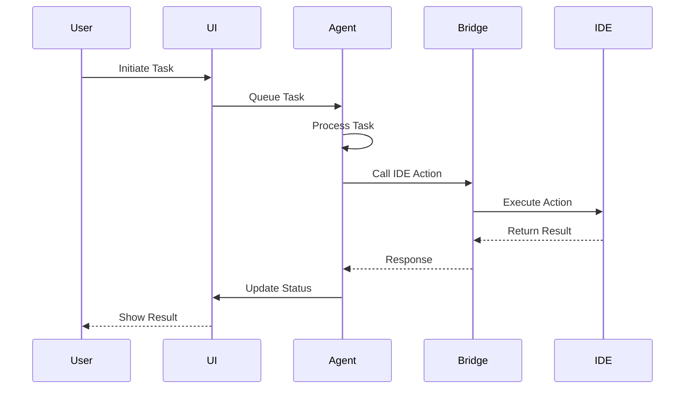

# Agent Framework for IntelliJ JCEF Browser: Comprehensive Documentation

## Table of Contents

1. [Executive Summary](#executive-summary)
2. [Introduction](#introduction)
3. [Comparison with Existing Solutions](#comparison-with-existing-solutions)
4. [Architecture Overview](#architecture-overview)
5. [Core Components](#core-components)
6. [Installation and Setup](#installation-and-setup)
7. [API Reference](#api-reference)
8. [Advanced Features](#advanced-features)
9. [Integration Guide](#integration-guide)
10. [Performance Optimization](#performance-optimization)
11. [Security Considerations](#security-considerations)
12. [Troubleshooting](#troubleshooting)
13. [Future Roadmap](#future-roadmap)
14. [Contributing](#contributing)

## Executive Summary

The **Agent Framework for IntelliJ JCEF Browser** is a JavaScript-native multi-agent system designed specifically for integration within IntelliJ IDEA's embedded browser environment. Unlike existing solutions that primarily target web applications or require external servers, this framework operates entirely within the IDE, providing seamless integration with development workflows while supporting Google's Agent-to-Agent (A2A) protocol for enterprise-scale agent communication.

### Key Differentiators

- **IDE-Native**: Runs entirely within IntelliJ's JCEF browser, no external dependencies
- **JavaScript-First**: Built for JavaScript developers, avoiding Python dependencies
- **Resource-Based Loading**: Uses custom `jcef://resource/` protocol for secure asset loading
- **Direct IDE Integration**: Manipulates code, files, and IDE features through JavaScript bridge
- **Google A2A Compatible**: Supports enterprise agent communication protocols

## Introduction

The rise of AI-powered development tools has created a need for sophisticated agent systems that can assist developers directly within their IDE environment. While frameworks like KaibanJS, AgenticJS, and LiveKit's agents-js have emerged for web and server environments, there has been a gap in IDE-integrated solutions.

This framework fills that gap by providing a comprehensive agent system that:

1. **Lives where developers work**: Integrated directly into IntelliJ IDEA
2. **Speaks their language**: Pure JavaScript implementation
3. **Understands their context**: Access to project files, code, and IDE features
4. **Scales with their needs**: From single agents to complex multi-agent workflows

## Comparison with Existing Solutions

### Framework Comparison Matrix

| Feature | Our Framework | KaibanJS | AgenticJS | LiveKit Agents | Google ADK | Mastra |
|---------|--------------|----------|-----------|----------------|------------|---------|
| **Environment** | IntelliJ JCEF | Browser/Node.js | Browser/Node.js | Node.js Server | Python/Java | TypeScript |
| **Language** | JavaScript | JavaScript | JavaScript | JavaScript/TypeScript | Python/Java | TypeScript |
| **IDE Integration** | Native ✓ | External | External | External | External | External |
| **Multi-Agent** | ✓ | ✓ | ✓ | ✓ | ✓ | ✓ |
| **Visual UI** | Built-in | Kanban Board | Built-in | Web Playground | Cloud Console | CLI |
| **Google A2A** | ✓ | ✗ | ✗ | ✗ | Native | ✗ |
| **Resource Loading** | Custom Protocol | HTTP/File | HTTP/File | HTTP | Cloud/Local | HTTP |
| **Agent Roles** | 10+ Predefined | Custom | Role-Based | Voice/Multimodal | Custom | Custom |
| **Deployment** | IDE-Only | Web/Cloud | Web/Cloud | Server | Cloud Run/Vertex | Cloud |

### Detailed Comparison

#### vs. KaibanJS
KaibanJS employs a Redux-inspired architecture, enabling a unified approach to manage the states of AI agents and uses a Kanban-style visualization. Our framework differs by:
- Operating within the IDE rather than requiring external deployment
- Providing direct code manipulation capabilities
- Using a task-queue architecture instead of Redux patterns

#### vs. AgenticJS
AgenticJS is designed with simplicity at its core and focuses on role-based agent design. Our framework extends this concept with:
- Pre-built specialized agents for development tasks
- Integration with IDE features (debugging, refactoring, etc.)
- Support for Google's enterprise protocols

#### vs. LiveKit Agents
The Agent Framework is designed for building realtime, programmable participants that run on servers, primarily for voice and multimodal applications. Our framework instead:
- Focuses on code generation and development workflows
- Runs client-side within the IDE
- Emphasizes text-based interactions over real-time audio

#### vs. Google ADK
ADK empowers developers like you to build production-ready agentic applications with greater flexibility and precise control. Our framework complements ADK by:
- Providing a JavaScript alternative to Python/Java implementations
- Enabling local IDE execution without cloud deployment
- Supporting A2A protocol for interoperability

#### vs. Mastra
Mastra is designed to be cloud deployable from the get go with TypeScript-first development. Our framework differs by:
- JavaScript implementation for broader compatibility
- IDE-specific features and integrations
- Focus on development workflows over general-purpose AI

## Architecture Overview

### System Architecture

```
┌─────────────────────────────────────────────────────────────┐
│                     IntelliJ IDEA                           │
├─────────────────────────────────────────────────────────────┤
│                    JCEF Browser                             │
│  ┌───────────────────────────────────────────────────────┐ │
│  │              Agent Framework Core                      │ │
│  │  ┌─────────────┐  ┌─────────────┐  ┌──────────────┐  │ │
│  │  │   Agents    │  │  Workflows  │  │   Manager    │  │ │
│  │  └──────┬──────┘  └──────┬──────┘  └──────┬───────┘  │ │
│  │         │                │                 │          │ │
│  │  ┌──────┴────────────────┴─────────────────┴───────┐  │ │
│  │  │           Message Bus & Event System             │  │ │
│  │  └──────────────────────┬───────────────────────────┘  │ │
│  │                         │                              │ │
│  │  ┌──────────────────────┴───────────────────────────┐  │ │
│  │  │          JavaScript Bridge (Chunked)             │  │ │
│  │  └──────────────────────┬───────────────────────────┘  │ │
│  └─────────────────────────┼─────────────────────────────┘ │
│                           │                                 │
├───────────────────────────┼─────────────────────────────────┤
│         IntelliJ Services │                                 │
│  ┌────────────┐  ┌────────┴──────┐  ┌──────────────────┐  │
│  │   Editor   │  │     Code      │  │       Git        │  │
│  │  Service   │  │   Service     │  │    Service       │  │
│  └────────────┘  └───────────────┘  └──────────────────┘  │
└─────────────────────────────────────────────────────────────┘
```

### Component Interaction Flow



## Core Components

### 1. Agent System

#### Base Agent Class

```javascript
class Agent {
    constructor(role, config = {}) {
        this.id = `${role.id}_${Date.now()}`;
        this.role = role;
        this.state = 'idle';
        this.memory = new Map();
        this.taskQueue = [];
        this.config = { ...window.AgentFramework.config, ...config };
        this.stats = {
            tasksCompleted: 0,
            tasksFailed: 0,
            totalExecutionTime: 0
        };
    }
}
```

#### Specialized Agents

1. **Coordinator Agent**
   - Orchestrates multi-agent workflows
   - Manages task delegation
   - Monitors overall progress
   - Aggregates results

2. **Code Generator Agent**
   - Generates code based on specifications
   - Supports multiple languages
   - Template-based generation
   - AI-powered enhancement

3. **Code Reviewer Agent**
   - Analyzes code quality
   - Checks coding standards
   - Suggests improvements
   - Calculates quality scores

4. **Testing Agent**
   - Creates unit tests
   - Generates test scenarios
   - Validates coverage
   - Runs regression tests

5. **Security Agent**
   - Scans for vulnerabilities
   - Checks dependencies
   - Validates authentication
   - Performs security audits

### 2. Task Management

#### Task Queue System

```javascript
// Task structure
{
    id: 'task_1234567890',
    type: 'generate',
    data: {
        // Task-specific data
    },
    priority: 5,
    callback: function(error, result) {},
    timestamp: Date.now()
}
```

#### Task Processing

- Asynchronous execution
- Priority-based scheduling
- Error handling and retry logic
- Progress tracking

### 3. Communication Layer

#### IntelliJ Bridge Integration

```javascript
// Chunked messaging for large payloads
window.intellijBridge.callIDE(action, data)
    .then(result => {
        // Handle response
    })
    .catch(error => {
        // Handle error
    });
```

#### Agent-to-Agent Communication

```javascript
// Direct messaging
await agent1.sendMessage(agent2.id, {
    type: 'request',
    data: payload
});

// Broadcast
window.AgentFramework.broadcast({
    type: 'notification',
    data: payload
});
```

### 4. UI Components

#### Agent Monitor

- Real-time status display
- Task queue visualization
- Performance metrics
- Interactive controls

#### Workflow Visualizer

- Step-by-step workflow display
- Progress indicators
- Error highlighting
- Result preview

## Installation and Setup

### Prerequisites

1. IntelliJ IDEA 2023.x or later
2. JCEF support enabled
3. Project with Java 11+ (for plugin compatibility)

### Installation Steps

1. **Plugin Installation**
   ```
   1. Open IntelliJ IDEA
   2. Go to Settings → Plugins
   3. Search for "Zest" (or your plugin name)
   4. Install and restart IDE
   ```

2. **Accessing the Framework**
   ```
   Option A: Menu
   - Right-click in editor → Zest → Show Agent Framework Demo
   
   Option B: Direct URL
   - Open browser panel
   - Navigate to: jcef://resource/html/agentDemo.html
   
   Option C: Programmatically
   - browserManager.loadAgentDemo()
   ```

3. **Verification**
   ```javascript
   // In browser console
   console.log(window.AgentFramework); // Should show framework object
   console.log(window.AgentUI); // Should show UI object
   ```

### Configuration

```javascript
// Initialize with custom configuration
window.AgentFramework.config = {
    maxChunkSize: 1400,
    sessionTimeout: 60000,
    maxRetries: 3,
    apiEndpoint: '/api/agent-to-agent'
};

// Google A2A Integration (optional)
await window.GoogleAgentIntegration.initialize({
    apiKey: 'YOUR_API_KEY',
    projectId: 'YOUR_PROJECT_ID',
    region: 'us-central1'
});
```

## API Reference

### AgentFramework API

#### Core Methods

```javascript
// Create an agent
const agent = await window.AgentFramework.createAgent(role, config);

// Create a team
const team = await window.AgentFramework.createTeam({
    name: 'Team Name',
    agents: [
        { role: 'CODE_GENERATOR' },
        { role: 'CODE_REVIEWER' }
    ]
});

// Register a workflow
window.AgentFramework.AgentManager.registerWorkflow(id, workflow);

// Execute a workflow
await window.AgentFramework.executeWorkflow(workflowId, data, teamId);

// Get status
const status = window.AgentFramework.AgentManager.getStatus();
```

#### Agent Methods

```javascript
// Queue a task
const taskId = agent.queueTask({
    type: 'generate',
    data: { /* task data */ },
    priority: 8,
    callback: (error, result) => { /* handle result */ }
});

// Send message to another agent
await agent.sendMessage(targetAgentId, {
    type: 'request',
    data: { /* message data */ }
});

// Get agent context
const context = agent.getContext();

// Terminate agent
agent.terminate();
```

### IntelliJ Bridge API

```javascript
// Insert code
await window.intellijBridge.callIDE('insertCode', {
    code: generatedCode,
    language: 'javascript'
});

// Show diff
await window.intellijBridge.callIDE('showCodeDiffAndReplace', {
    code: newCode,
    language: 'javascript',
    textToReplace: oldCode
});

// File operations
await window.intellijBridge.callIDE('replaceInFile', {
    filePath: 'src/MyClass.java',
    search: 'oldText',
    replace: 'newText'
});
```

## Advanced Features

### 1. Custom Agent Development

```javascript
class CustomAgent extends window.AgentFramework.Agent {
    constructor(config) {
        super({
            id: 'custom',
            name: 'Custom Agent',
            description: 'My custom agent',
            capabilities: ['custom_task'],
            priority: 5
        }, config);
    }
    
    async handle_custom_task(task) {
        // Custom implementation
        const result = await this.processCustomLogic(task.data);
        return result;
    }
    
    async processCustomLogic(data) {
        // Your custom logic here
        return { success: true, result: 'processed' };
    }
}

// Register and use
const customAgent = new CustomAgent();
await customAgent.initialize();
```

### 2. Workflow Composition

```javascript
const complexWorkflow = {
    name: 'Complex Development Workflow',
    steps: [
        {
            name: 'Analyze Requirements',
            type: 'parallel',
            substeps: [
                { requiredCapability: 'analyze_code', type: 'analyze' },
                { requiredCapability: 'scan_vulnerabilities', type: 'security_scan' }
            ]
        },
        {
            name: 'Generate Solution',
            type: 'sequential',
            substeps: [
                { requiredCapability: 'design_api', type: 'design' },
                { requiredCapability: 'generate', type: 'generate' },
                { requiredCapability: 'create_tests', type: 'test' }
            ]
        },
        {
            name: 'Review and Deploy',
            type: 'conditional',
            condition: (results) => results.tests.passed,
            substeps: [
                { requiredCapability: 'review', type: 'review' },
                { requiredCapability: 'document', type: 'document' }
            ]
        }
    ]
};
```

### 3. Memory and Learning

```javascript
// Agent memory persistence
class PersistentAgent extends Agent {
    async saveMemory() {
        const memoryData = Array.from(this.memory.entries());
        await window.intellijBridge.callIDE('saveData', {
            key: `agent_memory_${this.id}`,
            data: JSON.stringify(memoryData)
        });
    }
    
    async loadMemory() {
        const data = await window.intellijBridge.callIDE('loadData', {
            key: `agent_memory_${this.id}`
        });
        if (data) {
            const memoryData = JSON.parse(data);
            this.memory = new Map(memoryData);
        }
    }
}
```

### 4. Performance Monitoring

```javascript
// Custom performance tracking
window.AgentFramework.PerformanceMonitor = {
    metrics: new Map(),
    
    startTracking(agentId, taskId) {
        this.metrics.set(`${agentId}-${taskId}`, {
            startTime: performance.now(),
            memory: performance.memory?.usedJSHeapSize
        });
    },
    
    endTracking(agentId, taskId) {
        const key = `${agentId}-${taskId}`;
        const metric = this.metrics.get(key);
        if (metric) {
            metric.endTime = performance.now();
            metric.duration = metric.endTime - metric.startTime;
            metric.memoryDelta = performance.memory?.usedJSHeapSize - metric.memory;
            return metric;
        }
    },
    
    getReport() {
        return Array.from(this.metrics.entries()).map(([key, value]) => ({
            key,
            duration: value.duration,
            memoryDelta: value.memoryDelta
        }));
    }
};
```

## Integration Guide

### 1. Integrating with Existing IntelliJ Plugins

```java
// In your plugin code
public class AgentFrameworkConnector {
    private final JCEFBrowserManager browserManager;
    
    public void executeAgentTask(String taskType, Map<String, Object> data) {
        String script = String.format(
            "window.AgentFramework.executeTask('%s', %s)",
            taskType,
            new Gson().toJson(data)
        );
        browserManager.executeJavaScript(script);
    }
    
    public void registerCustomHandler() {
        // Register a custom handler in your JavaScriptBridge
        bridge.registerHandler("customAction", (data) -> {
            // Handle custom action from agents
            return processCustomAction(data);
        });
    }
}
```

### 2. Extending the Framework

```javascript
// Add custom agent role
window.AgentFramework.registerRole({
    id: 'domain_expert',
    name: 'Domain Expert Agent',
    description: 'Specialized knowledge agent',
    capabilities: ['analyze_domain', 'suggest_patterns'],
    priority: 7
});

// Add custom tool
window.AgentFramework.registerTool('customTool', {
    name: 'Custom Analysis Tool',
    execute: async (params) => {
        // Tool implementation
        return await performAnalysis(params);
    }
});
```

### 3. Google A2A Integration

```javascript
// Enable A2A for an agent
const agent = await window.AgentFramework.createAgent('CODE_GENERATOR');
await agent.registerWithGoogle();

// Collaborate with external Google agents
const result = await agent.collaborateWithGoogleAgent(
    'google-agent-id',
    {
        type: 'code_review',
        data: { code: generatedCode }
    }
);

// Handle incoming A2A requests
window.GoogleAgentIntegration.on('task_request', async (request) => {
    const agent = await window.AgentFramework.findOrCreateAgent(
        request.requiredRole
    );
    return await agent.executeTask(request.task);
});
```

## Performance Optimization

### 1. Task Batching

```javascript
// Batch multiple small tasks
class BatchingAgent extends Agent {
    constructor(role, config) {
        super(role, config);
        this.batchQueue = [];
        this.batchTimer = null;
        this.batchSize = config.batchSize || 10;
        this.batchDelay = config.batchDelay || 100;
    }
    
    queueTask(task) {
        this.batchQueue.push(task);
        
        if (this.batchQueue.length >= this.batchSize) {
            this.processBatch();
        } else if (!this.batchTimer) {
            this.batchTimer = setTimeout(() => this.processBatch(), this.batchDelay);
        }
    }
    
    processBatch() {
        if (this.batchTimer) {
            clearTimeout(this.batchTimer);
            this.batchTimer = null;
        }
        
        const batch = this.batchQueue.splice(0, this.batchSize);
        super.queueTask({
            type: 'batch',
            data: { tasks: batch }
        });
    }
}
```

### 2. Resource Management

```javascript
// Implement resource pooling
window.AgentFramework.ResourcePool = {
    agents: new Map(),
    maxAgentsPerRole: 5,
    
    async getAgent(role) {
        const roleAgents = this.agents.get(role) || [];
        
        // Find idle agent
        const idleAgent = roleAgents.find(a => a.state === 'idle');
        if (idleAgent) return idleAgent;
        
        // Create new if under limit
        if (roleAgents.length < this.maxAgentsPerRole) {
            const agent = await window.AgentFramework.createAgent(role);
            roleAgents.push(agent);
            this.agents.set(role, roleAgents);
            return agent;
        }
        
        // Wait for available agent
        return await this.waitForAgent(role);
    }
};
```

### 3. Caching Strategies

```javascript
// Implement result caching
window.AgentFramework.Cache = {
    store: new Map(),
    maxSize: 100,
    ttl: 3600000, // 1 hour
    
    set(key, value) {
        // Implement LRU if at capacity
        if (this.store.size >= this.maxSize) {
            const firstKey = this.store.keys().next().value;
            this.store.delete(firstKey);
        }
        
        this.store.set(key, {
            value,
            timestamp: Date.now()
        });
    },
    
    get(key) {
        const entry = this.store.get(key);
        if (!entry) return null;
        
        // Check TTL
        if (Date.now() - entry.timestamp > this.ttl) {
            this.store.delete(key);
            return null;
        }
        
        return entry.value;
    }
};
```

## Security Considerations

### 1. Input Validation

```javascript
// Validate agent inputs
class SecureAgent extends Agent {
    async executeTask(task) {
        // Validate task structure
        if (!this.validateTask(task)) {
            throw new Error('Invalid task structure');
        }
        
        // Sanitize inputs
        task.data = this.sanitizeData(task.data);
        
        return super.executeTask(task);
    }
    
    validateTask(task) {
        return task 
            && typeof task.type === 'string'
            && task.type.match(/^[a-zA-Z_]+$/)
            && typeof task.data === 'object';
    }
    
    sanitizeData(data) {
        // Remove potential XSS vectors
        return JSON.parse(JSON.stringify(data));
    }
}
```

### 2. Communication Security

```javascript
// Encrypted agent communication
window.AgentFramework.SecureChannel = {
    async encrypt(data, recipientId) {
        // Implement encryption
        const key = await this.getDerivedKey(recipientId);
        return await crypto.subtle.encrypt(
            { name: 'AES-GCM', iv: crypto.getRandomValues(new Uint8Array(12)) },
            key,
            new TextEncoder().encode(JSON.stringify(data))
        );
    },
    
    async decrypt(encryptedData, senderId) {
        const key = await this.getDerivedKey(senderId);
        const decrypted = await crypto.subtle.decrypt(
            { name: 'AES-GCM', iv: encryptedData.iv },
            key,
            encryptedData.data
        );
        return JSON.parse(new TextDecoder().decode(decrypted));
    }
};
```

### 3. Access Control

```javascript
// Role-based access control
window.AgentFramework.AccessControl = {
    permissions: new Map([
        ['CODE_GENERATOR', ['read_files', 'write_files', 'execute_code']],
        ['CODE_REVIEWER', ['read_files', 'add_comments']],
        ['TESTING', ['read_files', 'execute_tests']]
    ]),
    
    checkPermission(agentRole, action) {
        const rolePermissions = this.permissions.get(agentRole) || [];
        return rolePermissions.includes(action);
    },
    
    enforcePermission(agent, action) {
        if (!this.checkPermission(agent.role.id, action)) {
            throw new Error(`Agent ${agent.role.id} lacks permission for ${action}`);
        }
    }
};
```

## Troubleshooting

### Common Issues and Solutions

#### 1. Framework Not Loading

**Symptoms:**
- `window.AgentFramework` is undefined
- No console messages about framework loading

**Solutions:**
```javascript
// Check if JCEF is properly initialized
if (!window.intellijBridge) {
    console.error('IntelliJ Bridge not available');
}

// Manually load framework
const script = document.createElement('script');
script.src = 'jcef://resource/js/agentFramework.js';
document.head.appendChild(script);

// Wait for framework
await new Promise(resolve => {
    const check = setInterval(() => {
        if (window.AgentFramework) {
            clearInterval(check);
            resolve();
        }
    }, 100);
});
```

#### 2. Agent Communication Failures

**Symptoms:**
- Messages not reaching other agents
- Timeout errors

**Solutions:**
```javascript
// Enable debug logging
window.AgentFramework.debug = true;

// Monitor message bus
window.AgentFramework.MessageBus.on('error', (error) => {
    console.error('Message bus error:', error);
});

// Check agent states
const status = window.AgentFramework.AgentManager.getStatus();
console.log('Agent states:', status.agents.map(a => ({
    id: a.id,
    state: a.state,
    queueLength: a.queueLength
})));
```

#### 3. Performance Issues

**Symptoms:**
- Slow task execution
- High memory usage
- Browser becoming unresponsive

**Solutions:**
```javascript
// Monitor performance
const metrics = window.AgentFramework.PerformanceMonitor.getReport();
console.table(metrics);

// Limit concurrent agents
window.AgentFramework.config.maxConcurrentAgents = 3;

// Enable garbage collection
window.AgentFramework.gc = {
    interval: 60000, // 1 minute
    run() {
        // Clean up completed tasks
        for (const [id, agent] of window.AgentFramework.agents) {
            agent.memory.forEach((value, key) => {
                if (Date.now() - value.timestamp > 3600000) {
                    agent.memory.delete(key);
                }
            });
        }
    }
};
```

### Debugging Tools

```javascript
// Agent Inspector
window.AgentFramework.Inspector = {
    inspectAgent(agentId) {
        const agent = window.AgentFramework.agents.get(agentId);
        if (!agent) return 'Agent not found';
        
        return {
            id: agent.id,
            role: agent.role,
            state: agent.state,
            stats: agent.stats,
            queueLength: agent.taskQueue.length,
            memorySize: agent.memory.size,
            config: agent.config
        };
    },
    
    traceTask(taskId) {
        // Implementation for task tracing
    },
    
    exportLogs() {
        // Export all framework logs
    }
};

// Usage
console.log(window.AgentFramework.Inspector.inspectAgent('agent_123'));
```

## Future Roadmap

### Planned Features

1. **Enhanced AI Integration**
   - Direct integration with OpenAI, Anthropic, and Google AI models
   - Local LLM support for offline development
   - Fine-tuned models for specific development tasks

2. **Extended Agent Capabilities**
   - Database schema design agent
   - Performance optimization agent
   - Accessibility compliance agent
   - Internationalization agent

3. **Advanced Workflows**
   - Visual workflow designer
   - Conditional branching
   - Human-in-the-loop approvals
   - Workflow templates marketplace

4. **Enterprise Features**
   - Multi-project support
   - Team collaboration features
   - Audit logging
   - Compliance reporting

5. **Performance Enhancements**
   - WebAssembly modules for compute-intensive tasks
   - Worker thread support
   - Intelligent task scheduling
   - Predictive resource allocation

### Community Wishlist

Based on analysis of similar frameworks:
- Multi-Channel Support: Deploy bots on websites, WhatsApp, Slack, and more
- Full-Stack TypeScript Agents compatibility
- Integration with popular testing frameworks
- Support for additional IDEs (VS Code, WebStorm)

## Contributing

### How to Contribute

1. **Fork the Repository**
   ```bash
   git clone https://github.com/your-org/agent-framework
   cd agent-framework
   ```

2. **Create a Feature Branch**
   ```bash
   git checkout -b feature/your-feature-name
   ```

3. **Implement Your Feature**
   - Follow existing code style
   - Add tests for new functionality
   - Update documentation

4. **Submit a Pull Request**
   - Describe your changes
   - Reference any related issues
   - Ensure all tests pass

### Development Guidelines

1. **Code Style**
   ```javascript
   // Use consistent naming
   const myAgent = await createAgent(); // camelCase for variables
   class CustomAgent extends Agent {}   // PascalCase for classes
   
   // Document your code
   /**
    * Creates a new agent with specified configuration
    * @param {string} role - The agent role identifier
    * @param {Object} config - Configuration options
    * @returns {Promise<Agent>} The initialized agent
    */
   async function createAgent(role, config) {
       // Implementation
   }
   ```

2. **Testing**
   ```javascript
   describe('Agent Framework', () => {
       it('should create an agent', async () => {
           const agent = await AgentFramework.createAgent('CODE_GENERATOR');
           expect(agent).toBeDefined();
           expect(agent.role.id).toBe('code_generator');
       });
   });
   ```

3. **Documentation**
   - Update relevant documentation
   - Add JSDoc comments
   - Include usage examples

### Community

- **Discord**: [Join our community](https://discord.gg/agent-framework)
- **Issues**: [GitHub Issues](https://github.com/your-org/agent-framework/issues)
- **Discussions**: [GitHub Discussions](https://github.com/your-org/agent-framework/discussions)

---

## Conclusion

The Agent Framework for IntelliJ JCEF Browser represents a significant advancement in IDE-integrated AI assistance. By combining the flexibility of JavaScript with the power of multi-agent systems and the context of the IDE environment, it enables developers to create sophisticated automation workflows that enhance productivity while maintaining control over their development process.

As the field of AI-assisted development continues to evolve, frameworks like this will play a crucial role in bridging the gap between powerful AI capabilities and practical developer workflows. The support for industry standards like Google's A2A protocol ensures that this framework can grow and adapt with the broader ecosystem of AI agents.

Whether you're looking to automate repetitive tasks, enhance code quality, or explore new ways of integrating AI into your development workflow, this framework provides the foundation for building the next generation of intelligent development tools.

---

*Last updated: November 2024*
*Version: 1.0.0*
*License: Apache 2.0*