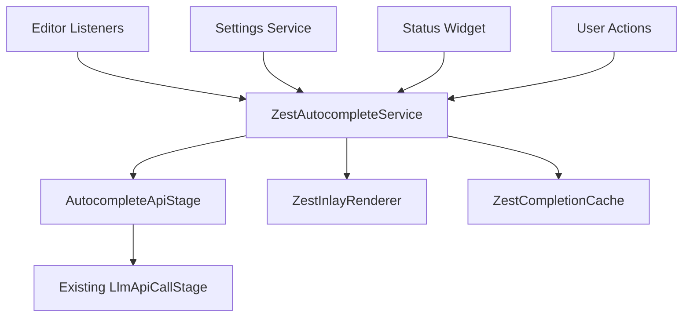

# Zest Autocomplete Feature Implementation Plan

## Overview

This document outlines the comprehensive plan for implementing an AI-powered autocomplete feature in the Zest IntelliJ plugin, leveraging the existing LLM API infrastructure and drawing inspiration from Continue.dev's autocomplete implementation.

## Table of Contents

1. [Architecture Overview](#architecture-overview)
2. [Implementation Phases](#implementation-phases)
3. [Technical Requirements](#technical-requirements)
4. [Integration Points](#integration-points)
5. [Development Timeline](#development-timeline)

## Architecture Overview

The Zest autocomplete system will be built around the following core components:

### Core Components



### Key Services

1. **ZestAutocompleteService** - Central orchestrator for all autocomplete functionality
2. **AutocompleteApiStage** - Specialized API handler extending your existing LLM infrastructure
3. **ZestInlayRenderer** - Custom renderer for displaying completions in the editor
4. **Editor Integration Layer** - Listeners and handlers for editor events
5. **Configuration Integration** - Settings and preferences management

## Implementation Phases

### Phase 1: Foundation (Week 1-2)
**MVP - Basic Autocomplete**

#### 1.1 Core Service Architecture
- [ ] Create `ZestAutocompleteService` as project-level service
- [ ] Implement `ZestPendingCompletion` data structure
- [ ] Basic configuration integration with existing settings

#### 1.2 API Integration
- [ ] Create `AutocompleteApiStage` extending existing pipeline architecture
- [ ] Implement specialized prompts for code completion
- [ ] Add timeout and cancellation support

#### 1.3 Basic Editor Integration
- [ ] Implement document change listeners
- [ ] Create caret position change handlers
- [ ] Basic completion triggering logic

#### 1.4 Simple Rendering
- [ ] Create `ZestInlayRenderer` for inline completions
- [ ] Implement basic gray text display
- [ ] Single-line completion support

### Phase 2: Core Functionality (Week 3-4)
**Enhanced Features**

#### 2.1 Advanced Rendering
- [ ] Multi-line completion support
- [ ] Improved visual styling
- [ ] Completion preview enhancements

#### 2.2 User Actions
- [ ] Accept completion (Tab key)
- [ ] Reject completion (Esc key)
- [ ] Partial accept functionality (Ctrl+Right)

#### 2.3 Smart Completion Logic
- [ ] Context-aware triggering
- [ ] Deduplication of existing code
- [ ] Language-specific handling

#### 2.4 Status Integration
- [ ] Status bar widget for autocomplete state
- [ ] Loading indicators
- [ ] Error state handling

### Phase 3: Polish & Optimization (Week 5-6)
**Production Ready**

#### 3.1 Performance Optimization
- [ ] Response caching
- [ ] Request debouncing
- [ ] Background processing improvements

#### 3.2 Advanced Features
- [ ] Settings panel integration
- [ ] Multiple completion options
- [ ] Context gathering improvements

#### 3.3 Error Handling & UX
- [ ] Comprehensive error handling
- [ ] User feedback mechanisms
- [ ] Graceful degradation

## Technical Requirements

### Dependencies

```gradle
dependencies {
    // Existing dependencies
    implementation 'com.google.code.gson:gson:2.8.9'
    
    // Additional dependencies for autocomplete
    implementation 'org.jetbrains.kotlinx:kotlinx-coroutines-core:1.6.4'
    implementation 'org.jetbrains.kotlinx:kotlinx-coroutines-swing:1.6.4'
}
```

### Project Structure

```
src/main/java/com/zps/zest/
├── autocomplete/
│   ├── ZestAutocompleteService.java
│   ├── AutocompleteApiStage.java
│   ├── ZestInlayRenderer.java
│   ├── ZestPendingCompletion.java
│   ├── actions/
│   │   ├── AcceptCompletionAction.java
│   │   ├── RejectCompletionAction.java
│   │   └── PartialAcceptCompletionAction.java
│   ├── listeners/
│   │   ├── ZestAutocompleteDocumentListener.java
│   │   ├── ZestAutocompleteCaretListener.java
│   │   └── ZestAutocompleteEditorListener.java
│   ├── ui/
│   │   ├── ZestAutocompleteStatusWidget.java
│   │   └── ZestAutocompleteSettings.java
│   └── utils/
│       ├── CompletionCache.java
│       ├── ContextGatherer.java
│       └── PromptBuilder.java
```

## Integration Points

### 1. Existing LLM Infrastructure

The autocomplete feature will leverage your existing `LlmApiCallStage` with these modifications:

```java
public class AutocompleteApiStage extends LlmApiCallStage {
    private static final int AUTOCOMPLETE_TIMEOUT_MS = 5000;
    private static final String AUTOCOMPLETE_SYSTEM_PROMPT = 
        "You are an AI code completion assistant...";
    
    @Override
    protected String buildPrompt(CodeContext context) {
        // Specialized prompt for autocomplete
        return new AutocompletePromptBuilder()
            .withFileContext(context.getFileContent())
            .withCursorPosition(context.getCursorPosition())
            .withLanguage(context.getLanguage())
            .build();
    }
    
    @Override
    protected boolean shouldUseStreaming(ConfigurationManager config) {
        // Prefer non-streaming for faster initial response
        return false;
    }
}
```

### 2. Configuration System

Extend your existing `ConfigurationManager`:

```java
public class ConfigurationManager {
    // Existing configuration...
    
    // Autocomplete-specific settings
    private boolean enableAutocomplete = true;
    private int autocompleteDelay = 300; // ms
    private boolean enableMultilineCompletions = true;
    private String autocompleteModel = "default";
    
    // Getters and setters...
}
```

### 3. Notification System

Integrate with your existing `ZestNotifications`:

```java
public class ZestNotifications {
    public static void showAutocompleteError(Project project, String message) {
        showNotification(project, "Zest Autocomplete", message, 
                        NotificationType.WARNING);
    }
    
    public static void showAutocompleteStatus(Project project, String status) {
        showNotification(project, "Zest Autocomplete", status, 
                        NotificationType.INFORMATION);
    }
}
```

## Development Timeline

### Week 1: Foundation Setup
- **Day 1-2**: Create core service architecture
- **Day 3-4**: Implement basic API integration
- **Day 5**: Set up editor listeners and basic triggering

### Week 2: MVP Implementation
- **Day 1-2**: Implement basic rendering system
- **Day 3-4**: Add user actions (accept/reject)
- **Day 5**: Integration testing and bug fixes

### Week 3: Enhanced Features
- **Day 1-2**: Multi-line completion support
- **Day 3-4**: Smart completion logic and deduplication
- **Day 5**: Status widget and visual improvements

### Week 4: Polish & Testing
- **Day 1-2**: Performance optimization and caching
- **Day 3-4**: Comprehensive testing and error handling
- **Day 5**: Documentation and final integration

### Week 5-6: Advanced Features (Optional)
- Settings panel integration
- Advanced context gathering
- Multiple completion providers
- User experience refinements

## Success Metrics

1. **Performance**: Completions triggered within 300ms of typing pause
2. **Accuracy**: >80% completion acceptance rate
3. **Stability**: <1% error rate in completion requests
4. **User Experience**: Seamless integration with existing workflow

## Risk Mitigation

1. **API Reliability**: Implement robust error handling and fallback mechanisms
2. **Performance Impact**: Use background processing and smart caching
3. **User Disruption**: Provide easy enable/disable toggle
4. **Integration Issues**: Extensive testing with existing Zest features

## Next Steps

1. Review and approve this implementation plan
2. Set up development environment and dependencies
3. Begin Phase 1 implementation
4. Regular progress reviews and adjustments

---

**Last Updated**: December 2024  
**Status**: Planning Phase  
**Estimated Completion**: 4-6 weeks
